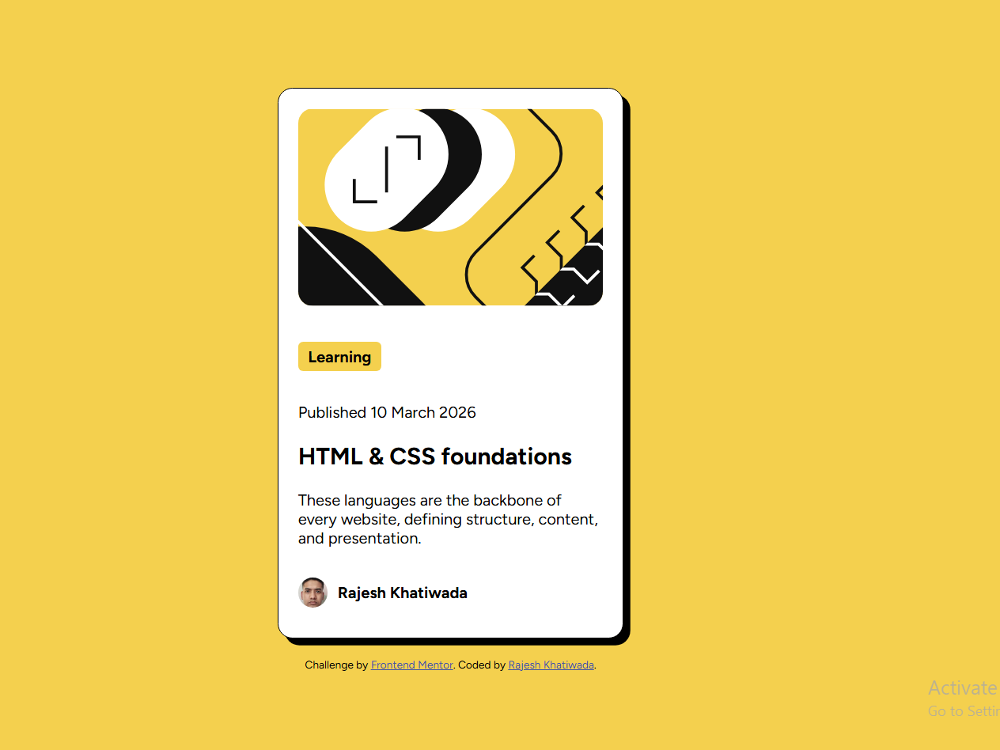

# Block Preview Card Component

A responsive preview card component built as part of the Frontend Mentor challenge.  
This project focuses on improving HTML and CSS skills, especially layout, spacing, and responsive design.

---

## 📸 Screenshot

---

## 🛠️ Built With

- HTML5
- CSS3
- Flexbox
- Responsive Design
- Mobile-first workflow

---

## 📌 Features

- Clean and modern card UI
- Fully responsive layout for mobile and desktop
- Hover effects for better interactivity
- Centered card design using Flexbox
- Pixel-perfect design based on challenge UI

---

## 📁 Project Structure

block-preview-card-main/
├── index.html
├── style.css
├── images/
│ └── (assets used in project)
├── screenshot.png
└── README.md

---

## 📖 What I Learned

While building this project, I practiced:

- Using Flexbox to center elements
- Creating responsive card layouts
- Managing spacing and typography
- Working with design constraints from Frontend Mentor
- Improving CSS structure and readability

---

## 🚀 Future Improvements

- Add smooth hover animations
- Improve accessibility (ARIA labels)
- Convert into a reusable React component
- Enhance mobile responsiveness further

---

## 👨‍💻 Author

- GitHub: [@KhatiwadaR](https://github.com/KhatiwadaR)

---

## 📌 Acknowledgments

- Challenge by [Frontend Mentor](https://www.frontendmentor.io/)
